# Раздел диплома «ПРОЕКТИРОВАНИЕ» по проекту `ai-servise`

> Раздел написан по фактической реализации из репозитория. Текст можно вставлять в диплом практически без доработки.

---

## 1. Проектирование на уровне требований

### 1.1 Функциональные требования (что реально реализовано)

Система `ai-servise` должна обеспечивать:

1. Проверку работоспособности сервиса: `GET /health`.
2. Обычную генерацию текста: `POST /generate`.
3. Потоковую генерацию (стриминг): `POST /generate/stream`.
4. Генерацию доменных имен: `POST /generate/domains`.
5. Унифицированный запуск режимов: `POST /mode/run` (режимы: `chat`, `domains`, `support_faq`; `php_page` в mode-run отключен).
6. Импорт FAQ: `POST /support/faq/import`.
7. Импорт FAQ из диалогов: `POST /support/dialogs/import`.
8. Ответ по FAQ: `POST /support/faq/ask`.
9. Генерацию PHP-файла из шаблона: `POST /page-template/generate-file`.
10. Gateway-кабинет: регистрация/логин, каталог моделей, генерация, история, админ-панель.
11. OpenAI-совместимый слой поверх gateway: `GET /v1/models`, `POST /v1/chat/completions`.

### 1.2 Нефункциональные требования

- **Производительность:** приемлемая задержка ответов для локальных и внешних моделей.
- **Наблюдаемость:** лог запросов, usage-логи gateway, endpoint статистики `/stats`.
- **Безопасность:** ключи доступа и разделение ролей (user/admin).
- **Расширяемость:** возможность добавлять модели в каталог без переписывания API-контрактов.
- **Развертываемость:** запуск через Docker Compose (nginx + api + postgres).

### 1.3 Команды для запуска потоковой генерации (стриминг)

Ниже готовые команды, которые можно вставить в раздел «Проверка требований» и использовать в демо.

```bash
# 1) Проверка, что сервис доступен
curl http://127.0.0.1:8080/health

# 2) Стриминг генерации (получение чанков)
curl -N -X POST "http://127.0.0.1:8080/generate/stream" \
  -H "Content-Type: application/json" \
  -d '{"prompt":"Напиши 5 коротких слоганов для хостинга"}'
```

Ожидаемая логика ответа: сервис возвращает NDJSON-чанки, а в конце — завершающий объект с `done=true`.

### 1.4 Важное уточнение про OpenAI-совместимость и OpenRouter

В проекте нет обязательной зависимости от официального облака OpenAI как провайдера модели. Реализация использует **OpenAI-совместимый формат запросов/ответов** и может направлять вызовы в **OpenRouter** (через `OPENAI_BASE_URL=https://openrouter.ai/api/v1` и ваш `OPENAI_API_KEY` формата `sk-or-v1-...`).

То есть формулировка для диплома корректная такая:

- «В системе реализован OpenAI-совместимый API-слой для внешних клиентов; фактический внешний провайдер — OpenRouter».

---

## 2. Архитектурное проектирование

### 2.1 Контекстная диаграмма (C4 L1)

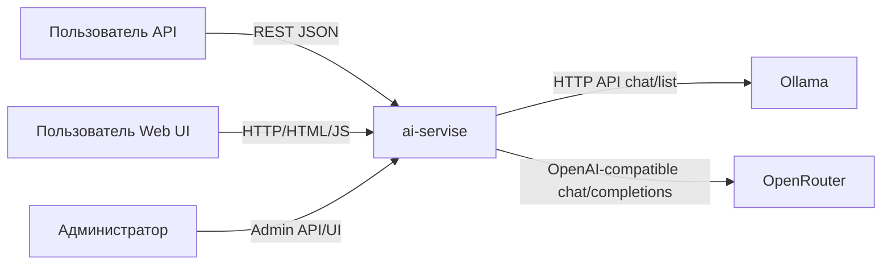

Подписи, которые оставить под рисунком:

- Пользователь API: работает с `/generate`, `/generate/stream`, `/generate/domains`, `/mode/run`, `/support/*`.
- Пользователь Web UI: работает с `/gateway/*` HTML-страницами.
- Внешний облачный провайдер: OpenRouter по OpenAI-совместимому протоколу.

### 2.2 Контейнерная диаграмма (C4 L2)

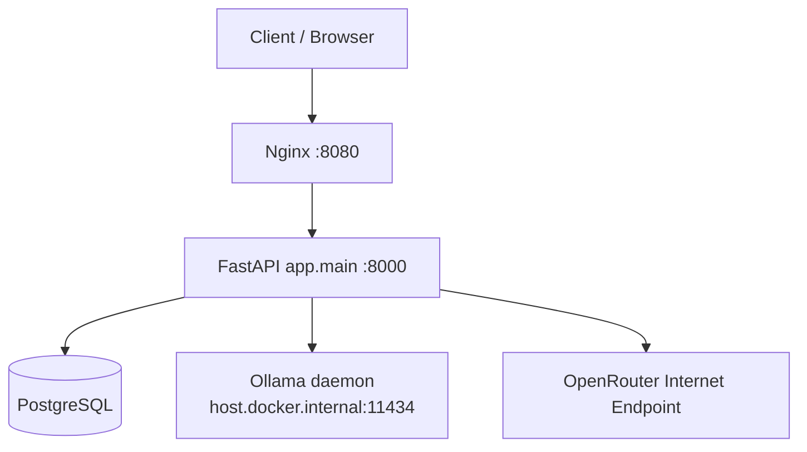

Текст под рисунком:

- Точка входа — `nginx` (порт 8080).
- Бизнес-логика и API-контракты — `api` (FastAPI).
- Персистентность — `postgres`.
- Ollama подключается как внешний runtime (через host gateway), OpenRouter — внешний интернет endpoint.

---

## 3. Группировка API по подсистемам (полностью заполнено)

### 3.1 Базовый API

- `GET /health`
- `POST /generate`
- `POST /generate/stream`
- `POST /generate/domains`
- `POST /mode/run`
- `GET /history`
- `GET /stats`

### 3.2 FAQ и шаблоны

- `POST /support/faq/import`
- `POST /support/dialogs/import`
- `POST /support/faq/ask`
- `POST /page-template/generate-file`
- `POST /page-template/prepare-hosting`

### 3.3 Gateway + OpenAI-совместимый слой

- Публичные UI-страницы gateway:
  - `GET /gateway`, `/gateway/login`, `/gateway/register`, `/gateway/profile`, `/gateway/models/page`, `/gateway/model/{model_id}`, `/gateway/history`, `/gateway/admin`
- Gateway API:
  - `POST /gateway/register`
  - `POST /gateway/login`
  - `GET /gateway/me`
  - `GET /gateway/models`
  - `GET /gateway/models/{model_id}`
  - `POST /gateway/generate`
  - `GET /gateway/usage`
- Gateway Admin API:
  - `GET /gateway/admin/users`
  - `PATCH /gateway/admin/users/{user_id}`
  - `GET /gateway/admin/users/{user_id}/usage`
  - `DELETE /gateway/admin/users/{user_id}`
  - `GET /gateway/admin/models`
  - `POST /gateway/admin/models`
  - `PATCH /gateway/admin/models/{model_id}`
  - `DELETE /gateway/admin/models/{model_id}`
- OpenAI-совместимые:
  - `GET /v1/models`
  - `POST /v1/chat/completions`

---

## 4. Контрактные требования к API (что уже есть в проекте)

### 4.1 Авторизационные контракты

1. `X-API-Key` — используется для:
   - `POST /support/faq/import`
   - `POST /support/dialogs/import`
2. `X-Gateway-Key` — требуется для пользовательского gateway API:
   - `/gateway/me`, `/gateway/models*`, `/gateway/generate`, `/gateway/usage`.
3. Gateway admin-права — для `/gateway/admin/*` (проверка роли admin).
4. `Authorization: Bearer <gateway_key>` — для `/v1/models` и `/v1/chat/completions`.

### 4.2 Валидация payload (уже реализована через Pydantic)

- Ограничения длины prompt, параметров temperature/max_tokens, лимитов выборки и др. заданы в `app/schemas.py`.
- На уровне API возвращаются корректные HTTP-статусы при нарушении контракта (`400`, `401`, `403`, `404`, `409`, `500`, `502`).

### 4.3 Поведенческие контракты

- `/generate/stream` возвращает `application/x-ndjson`.
- `/gateway/generate` возвращает также токены и вычисленную стоимость (`tokens_spent`).
- `/v1/chat/completions` возвращает OpenAI-совместимую структуру `choices` и `usage`.

---

## 5. Диаграмма маршрутизации API

```mermaid
flowchart TD
    IN[/HTTP Request/] --> R{Route Group}

    R --> B[Basic API]
    R --> F[FAQ & Templates]
    R --> G[Gateway API]
    R --> O[OpenAI-compatible]

    B --> B1[/health]
    B --> B2[/generate]
    B --> B3[/generate/stream]
    B --> B4[/generate/domains]
    B --> B5[/mode/run]
    B --> B6[/history]
    B --> B7[/stats]

    F --> F1[/support/faq/import\nX-API-Key]
    F --> F2[/support/dialogs/import\nX-API-Key]
    F --> F3[/support/faq/ask]
    F --> F4[/page-template/generate-file]

    G --> G1[/gateway/register]
    G --> G2[/gateway/login]
    G --> G3[/gateway/me\nX-Gateway-Key]
    G --> G4[/gateway/models*\nX-Gateway-Key]
    G --> G5[/gateway/generate\nX-Gateway-Key]
    G --> GA[/gateway/admin/*\nAdmin role]

    O --> O1[/v1/models\nBearer gateway key]
    O --> O2[/v1/chat/completions\nBearer gateway key]
```

---

## 6. Проектирование модели данных и ER-диаграмма

### 6.1 Почему в ER видны 2 связанные таблицы + 4 несвязанных

Да, для текущей реализации это нормально и логически обосновано:

- **Явная фактическая связь в коде:** `gateway_users (1) -> (N) gateway_usage_logs` по `user_id`.
- Остальные таблицы в текущем дизайне используются как:
  - `request_logs` — общий журнал генераций;
  - `support_faq_entries` — база знаний;
  - `support_faq_query_metrics` — аналитика качества FAQ;
  - `ai_models_catalog` — справочник моделей/тарифов.

Они связаны **логически через бизнес-процессы**, но не через жесткие внешние ключи. Это допустимо для диплома, если прямо указать, что часть связей soft/logical, а не hard FK.

### 6.2 ER-диаграмма

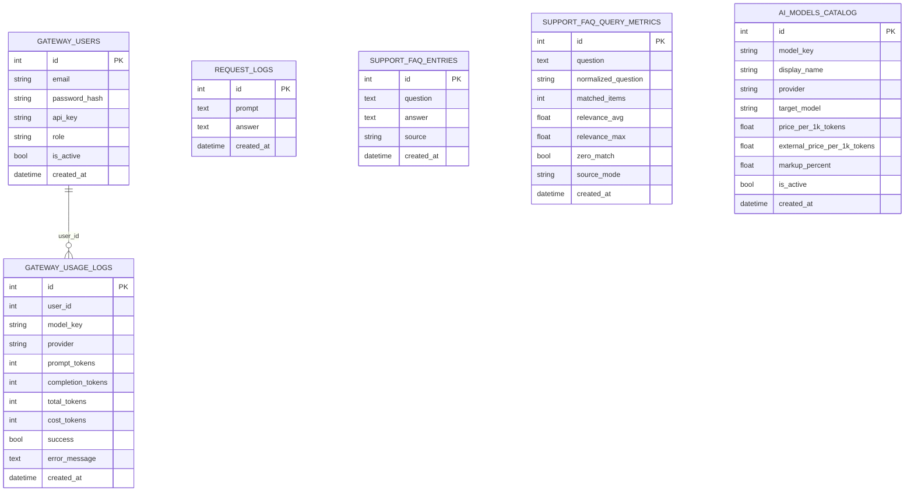

---

## 7. Проектирование ключевых сценариев (диаграммы для всех сценариев)

### 7.1 Сценарий A — обычная генерация `/generate`

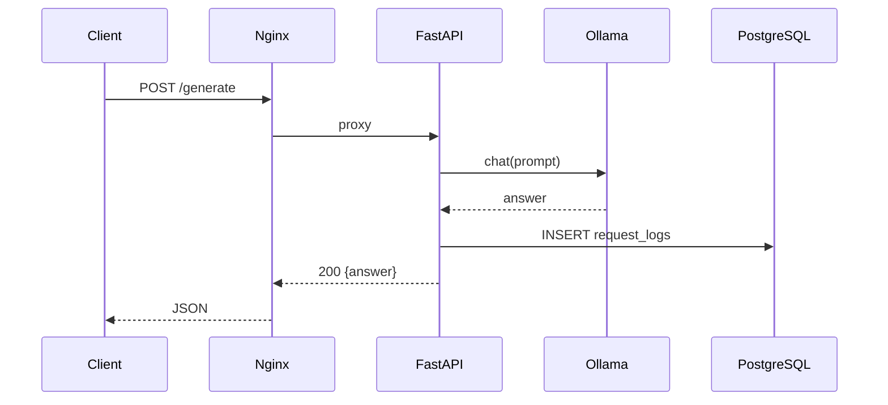

### 7.2 Сценарий B — потоковая генерация `/generate/stream`

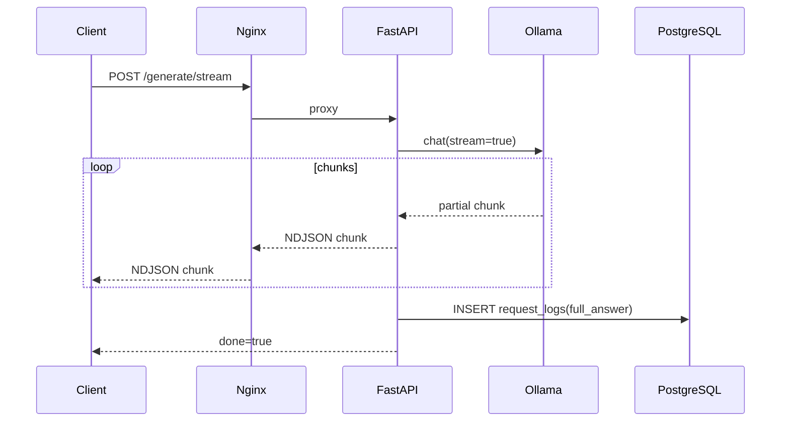

### 7.3 Сценарий C — gateway генерация `/gateway/generate`

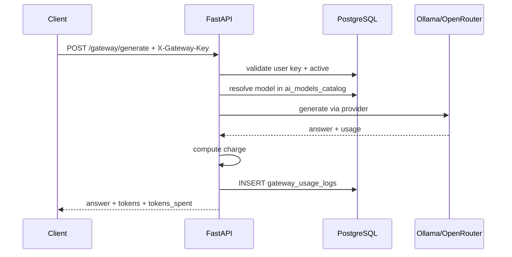

### 7.4 Сценарий D — FAQ ответ `/support/faq/ask`

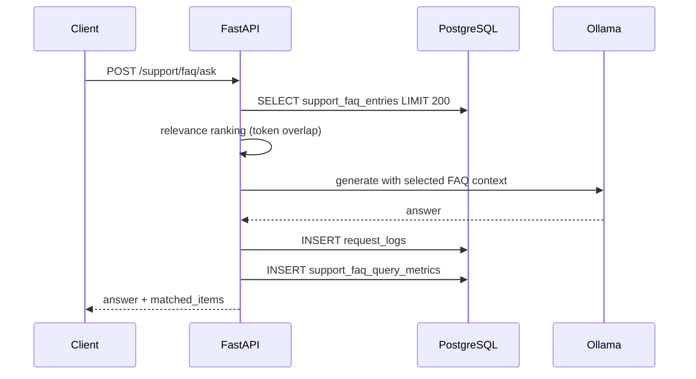

### 7.5 Сценарий E — OpenAI-совместимый вызов `/v1/chat/completions`

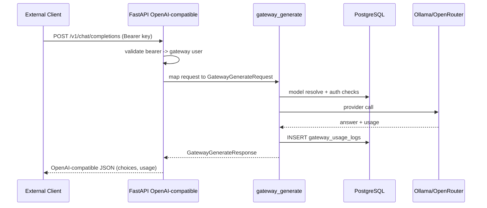

---

## 8. Проектирование безопасности

### 8.1 Модель доступа (полная)

1. **Public endpoints** (без ключа):
   - `/health`, `/generate`, `/generate/stream`, `/generate/domains`, `/mode/run`, `/history`, `/stats`, `/support/faq/ask`, `/page-template/generate-file`.
2. **Admin API key (`X-API-Key`)**:
   - `/support/faq/import`, `/support/dialogs/import`.
3. **Gateway user key (`X-Gateway-Key`)**:
   - `/gateway/me`, `/gateway/models*`, `/gateway/generate`, `/gateway/usage`.
4. **Gateway admin role**:
   - все `/gateway/admin/*`.
5. **Bearer gateway key**:
   - `/v1/models`, `/v1/chat/completions`.

### 8.2 Диаграмма авторизации

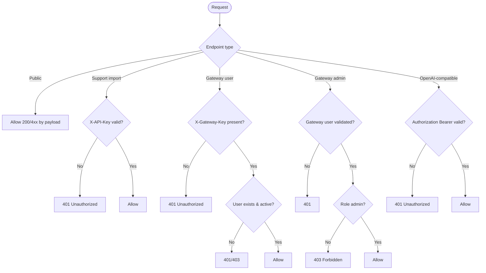

### 8.3 Что указать как ограничения и улучшения

- Пароли хранятся в формате salt+hash (PBKDF2), это корректно.
- API-ключи возвращаются и используются в клиентском UI: нужен policy по ротации и безопасному хранению.
- Рекомендуется добавить rate limiting и аудит подозрительной активности.

---

## 9. Диаграмма развертывания (полностью и четко)

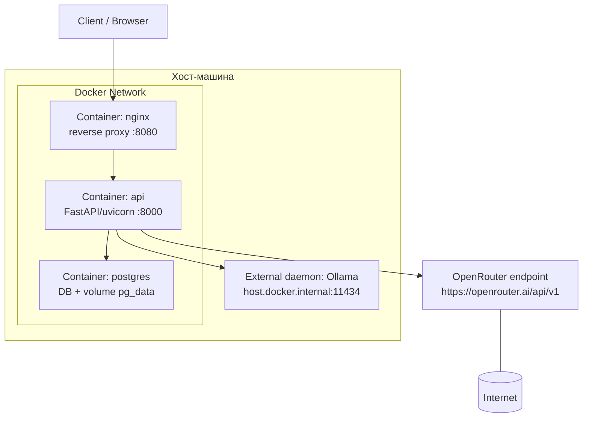

Подписи к узлам в дипломе:

- `nginx`: точка входа внешнего HTTP-трафика.
- `api`: прикладная логика, маршрутизация, интеграции с LLM.
- `postgres`: хранение логов, FAQ, пользователей, моделей, usage.
- `ollama`: локальный inference runtime.
- `openrouter`: внешний OpenAI-совместимый провайдер.

---

## 10. Масштабируемость и отказоустойчивость

### 10.1 Сформулированные ограничения текущего решения

Текущее состояние:

- монолитный API-процесс;
- синхронные внешние вызовы провайдерам;
- отсутствие очереди фоновых задач;
- ограниченная observability (без Prometheus/Grafana);
- возможная деградация при резком росте логов.

Целевой дизайн развития:

1. Горизонтальное масштабирование API-инстансов за балансировщиком.
2. Вынесение долгих/тяжелых операций в очередь (Celery/RQ + Redis).
3. Кеширование повторяющихся запросов и метаданных моделей.
4. Введение квот и rate limiting для защиты от перегрузки.
5. Метрики SLI/SLO и мониторинг latency/error-rate.

### 10.2 Диаграмма «точки отказа и меры»

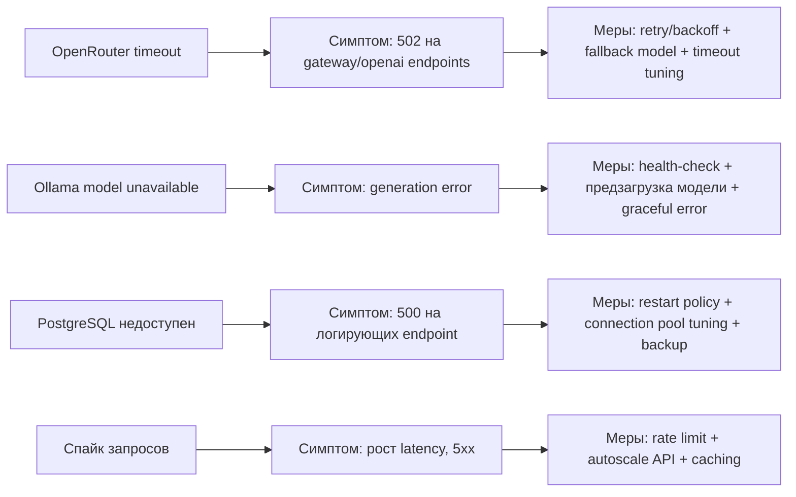

---

## 11. Ключевые проектные решения и обоснование (с учетом вашей бизнес-идеи)

### 11.1 Почему API-first подход

Потому что это сразу дает два канала использования одной логики:

- direct API-интеграции клиентов;
- web-кабинет как «тонкий клиент» поверх тех же API.

Это снижает дублирование кода и упрощает развитие продукта в коммерческий сервис.

### 11.2 Почему гибрид локальных и внешних моделей

Вы изначально строили локальную генерацию контента, а затем добавили модель «аналог OpenRouter» как коммерческий слой. Гибридный подход дает:

- локальные модели: независимость, контроль, низкая себестоимость базовых сценариев;
- внешние модели: повышение качества/вариативности и доступ к более сильным LLM без апгрейда локального железа.

### 11.3 Почему хранится аналитика затрат и использования

Это напрямую связано с вашей новой бизнес-целью — монетизация простаивающих вычислительных ресурсов:

- нужно понимать себестоимость и маржинальность;
- нужно видеть токенопотребление по пользователям и моделям;
- нужно поддерживать биллинг-логику и управленческую отчетность.

### 11.4 Почему gateway выделен отдельным слоем

Без gateway у вас просто набор технических endpoint’ов генерации. С gateway появляется продуктовый слой:

- регистрация и ключи;
- каталог моделей;
- ролевая админка;
- usage-логи и расчет стоимости;
- OpenAI-совместимый интерфейс для внешних клиентов.

Именно gateway превращает локальный инструмент в потенциальный сервис «LLM as a platform».

### 11.5 Почему Docker Compose

Потому что для диплома и демо важна воспроизводимость:

- одной командой поднимается одинаковая среда;
- предсказуемые зависимости и конфиги;
- проще проводить экспериментальные замеры и повторяемые прогоны.

---

## 12. Мини-чеклист для этого раздела

- [ ] Вставлена диаграмма контекста.
- [ ] Вставлена контейнерная диаграмма.
- [ ] Полностью перечислены API по группам.
- [ ] Есть диаграмма маршрутизации API.
- [ ] Есть ER-диаграмма и объяснение soft-связей.
- [ ] Есть sequence-диаграммы для всех ключевых сценариев.
- [ ] Есть диаграмма авторизации.
- [ ] Есть deployment-диаграмма.
- [ ] Есть диаграмма отказов и мер.
- [ ] Зафиксированы 5 ключевых проектных решений с обоснованием.

