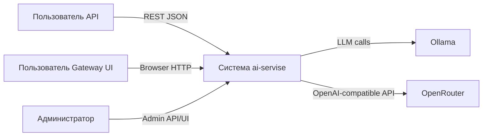
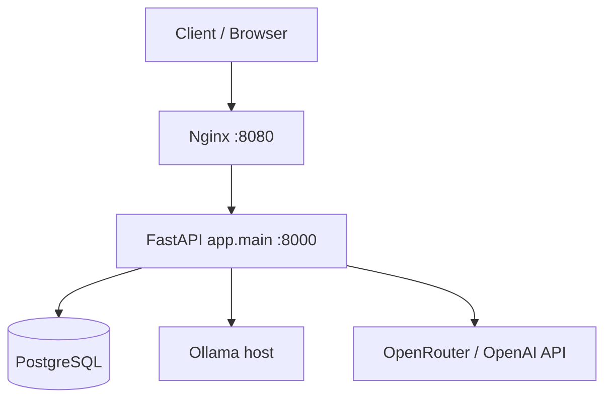
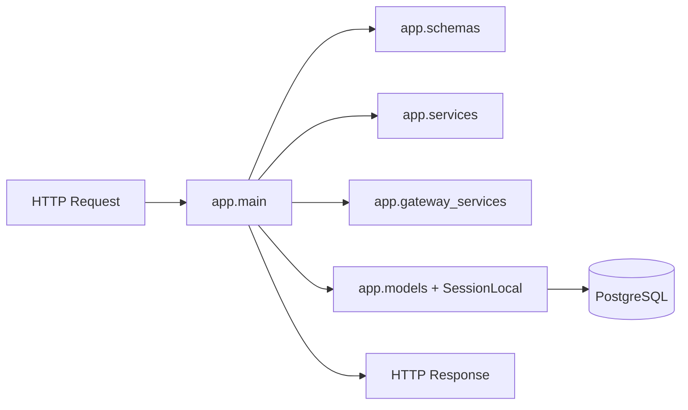
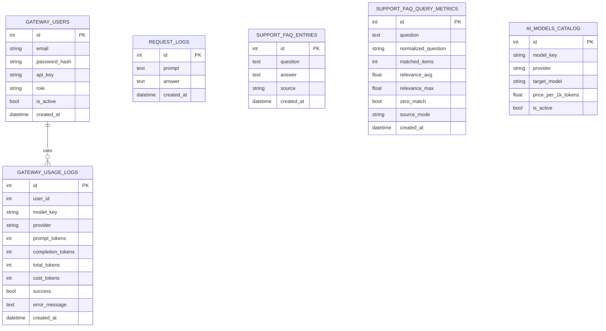
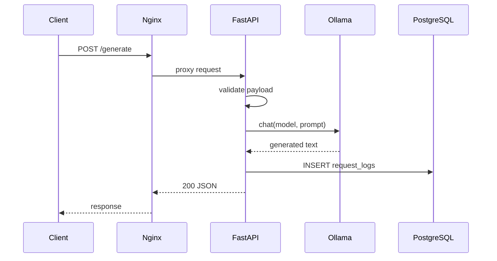

# Раздел диплома «ПРОЕКТИРОВАНИЕ» (детализированный шаблон для проекта `ai-servise`)

> Ниже — готовый, развёрнутый текст именно для главы **«Проектирование»**. Его можно вставлять в диплом как отдельную главу (или как крупный подраздел главы «Разработка»).

---

## 1. Цели и задачи проектирования

### 1.1 Цель проектирования

Цель этапа проектирования — формально описать будущую программную систему `ai-servise` как совокупность взаимосвязанных компонентов, интерфейсов и хранилищ данных, чтобы обеспечить:

- реализуемость заявленных бизнес-сценариев;
- масштабируемость при увеличении нагрузки;
- контролируемую безопасность доступа;
- наблюдаемость (логирование и метрики);
- воспроизводимость развертывания и экспериментов.

### 1.2 Задачи проектирования

На этапе проектирования решаются следующие задачи:

1. Выделение акторов (пользователь, администратор, внешние интеграции, LLM-провайдеры).
2. Декомпозиция системы на контейнеры и внутренние компоненты.
3. Определение API-контрактов и форматов обмена.
4. Проектирование схемы хранения данных и ключевых сущностей.
5. Проектирование потоков выполнения (sequence) для критичных сценариев.
6. Проектирование мер безопасности, отказоустойчивости и расширяемости.

---

## 2. Проектирование на уровне требований

### 2.1 Функциональные требования (для проектных решений)

Система должна поддерживать:

- генерацию текста в синхронном режиме;
- потоковую генерацию (streaming);
- специализированный режим генерации доменных имен;
- FAQ-режим на основе импортируемых Q/A-пар;
- генерацию PHP-страницы по шаблону;
- gateway-функционал (регистрация, авторизация, каталог моделей, тарификация);
- OpenAI-совместимые эндпоинты для внешних клиентов.

### 2.2 Нефункциональные требования

Ключевые нефункциональные требования, влияющие на проектирование:

- **Производительность:** приемлемые latency для генерации и gateway-запросов.
- **Безопасность:** разграничение прав, ключевая аутентификация, базовая защита админ-операций.
- **Надежность:** корректная обработка ошибок провайдеров моделей.
- **Поддерживаемость:** модульная структура backend-кода.
- **Переносимость:** контейнерное развертывание через Docker Compose.
- **Наблюдаемость:** журнал запросов и вычисляемая статистика по эксплуатации.

---

## 3. Архитектурное проектирование (уровень контекста и контейнеров)

### 3.1 Контекстная диаграмма системы (C4, Level 1)

**Что показать на диаграмме:**

- границу системы `ai-servise`;
- внешних акторов и системы;
- типы взаимодействия (HTTP API, браузерный доступ, LLM API).

**Какие блоки добавить:**

1. **Пользователь API** (клиентское приложение / curl / Postman).
2. **Пользователь Gateway UI** (браузер).
3. **Администратор** (браузер + админ-эндпоинты).
4. **Система `ai-servise`** (единая граница).
5. **Ollama** (внешний сервис локальных моделей).
6. **OpenRouter/OpenAI-compatible endpoint** (внешний облачный провайдер).

**Подписи на стрелках (обязательно):**

- Пользователь API -> `ai-servise`: `HTTPS JSON (REST): /generate, /mode/run, /support/*`.
- Пользователь Gateway UI -> `ai-servise`: `HTTPS + HTML/JS: /gateway/*`.
- Администратор -> `ai-servise`: `Admin REST: /gateway/admin/*`.
- `ai-servise` -> Ollama: `HTTP API (chat/list)`.
- `ai-servise` -> OpenRouter: `OpenAI-compatible chat/completions`.

**Рекомендуемая вставка (Mermaid):**

---

### 3.2 Контейнерная диаграмма (C4, Level 2)

**Цель:** показать, из каких runtime-контейнеров состоит решение и как они соединены.

**Контейнеры и их роли:**

1. **Nginx (reverse proxy)**
   - точка входа по порту 8080;
   - маршрутизация HTTP-трафика к API-сервису.
2. **FastAPI application (`app.main`)**
   - бизнес-логика всех режимов;
   - gateway и OpenAI-совместимый слой;
   - доступ к БД и внешним LLM.
3. **PostgreSQL**
   - хранение логов, FAQ, пользователей, моделей, usage-метрик.
4. **Ollama (внешний daemon)**
   - инференс локальных моделей.
5. **OpenRouter/OpenAI provider**
   - инференс внешней модели.

**Подписи стрелок:**

- `Client -> Nginx`: `HTTP :8080`.
- `Nginx -> FastAPI`: `proxy_pass /`.
- `FastAPI -> PostgreSQL`: `SQLAlchemy + psycopg`.
- `FastAPI -> Ollama`: `HTTP /api/chat`.
- `FastAPI -> OpenRouter`: `POST /chat/completions`.

**Рекомендуемая диаграмма:**

**Что подписать в дипломе под рисунком:**

- «Рисунок X — Контейнерная архитектура развертывания `ai-servise`».
- В пояснении отдельно отметить, что `Ollama` не обязательно контейнеризуется в данном compose, а подключается как внешний host service.

---

## 4. Компонентное проектирование backend (уровень кода)

### 4.1 Декомпозиция FastAPI-приложения

На компонентном уровне backend проектируется как набор модулей:

- **`app.main`** — слой маршрутизации и orchestration;
- **`app.schemas`** — Pydantic-контракты входа/выхода;
- **`app.models`** — ORM-сущности БД;
- **`app.services`** — прикладные режимы и алгоритмы post-processing;
- **`app.gateway_services`** — провайдеры моделей, токены/стоимость, auth-утилиты;
- **`app.page_templates`** — обработка placeholder-шаблонов PHP;
- **`app.db` / `app.settings`** — инфраструктурная конфигурация.

### 4.2 Компонентная диаграмма внутри API

**Что обязательно отразить:**

1. Входной request приходит в `app.main`.
2. `app.main` валидирует payload через `app.schemas`.
3. Для бизнес-операции вызывает `app.services` / `app.gateway_services`.
4. Для чтения/записи — обращается к `SessionLocal` и ORM-моделям.
5. Возвращает сериализованный response.

**Рекомендуемая диаграмма:**

**Подписи блоков:**

- `app.main` — «API orchestration + routes».
- `app.services` — «режимы генерации, FAQ ranking, парсинг».
- `app.gateway_services` — «auth, pricing, provider adapters».
- `app.models` — «персистентные сущности».

---

## 5. Проектирование API-интерфейсов

### 5.1 Группировка API по подсистемам

Для проектной документации полезно разделить API на 3 группы:

1. **Базовый API**
   - `/health`, `/generate`, `/generate/stream`, `/generate/domains`, `/mode/run`, `/history`, `/stats`.
2. **FAQ и шаблоны**
   - `/support/faq/import`, `/support/dialogs/import`, `/support/faq/ask`, `/page-template/generate-file`.
3. **Gateway + OpenAI compatible**
   - `/gateway/*`, `/v1/models`, `/v1/chat/completions`.

### 5.2 Контрактные требования к API

В проектировании нужно формально зафиксировать:

- обязательные заголовки (`X-Gateway-Key`, `Authorization: Bearer ...`, `X-API-Key`);
- допустимые диапазоны параметров (`max_tokens`, `temperature`, `limit`);
- единый формат ошибок (рекомендуется доработать до стандартизированного error schema);
- правила обратной совместимости (изменения без breaking changes).

### 5.3 Диаграмма маршрутизации API

**Что нарисовать:**

- единая точка входа `/`;
- ветки на `basic`, `support`, `gateway`, `openai-compatible`;
- подписи «Auth required / No auth / Admin only».

**Подписи веток:**

- Basic: `mostly public endpoints`.
- Support import: `admin api key required`.
- Gateway: `X-Gateway-Key required`.
- Admin gateway: `gateway admin role required`.
- OpenAI compatible: `Bearer gateway key`.

---

## 6. Проектирование модели данных

### 6.1 Логическая модель данных

Сущности и назначение:

1. `request_logs` — хранение пользовательских prompt/answer для базовой аналитики.
2. `support_faq_entries` — база знаний FAQ.
3. `support_faq_query_metrics` — метрики релевантности FAQ-ответов.
4. `gateway_users` — учетные записи и API-ключи пользователей.
5. `ai_models_catalog` — каталог доступных моделей и ценовые параметры.
6. `gateway_usage_logs` — использование моделей и стоимость по токенам.

### 6.2 ER-диаграмма (что именно рисовать)

**Обязательные связи:**

- `gateway_users (1) -> (N) gateway_usage_logs` по `user_id`.
- `ai_models_catalog` логически связано с `gateway_usage_logs.model_key` (даже если внешнего FK нет — отметить как soft relation).
- `support_faq_entries` используется при расчете `support_faq_query_metrics` (logical dependency).

**Рекомендуемая Mermaid ER-диаграмма:**

### 6.3 Что подписать в тексте под ER-диаграммой

- какие сущности являются операционными (gateway_usage_logs);
- какие аналитическими (support_faq_query_metrics, request_logs);
- какие справочными (ai_models_catalog).

Это важно для обоснования будущего масштабирования и архивирования.

---

## 7. Проектирование ключевых сценариев (sequence diagrams)

Ниже — сценарии, которые нужно показать в дипломе обязательно.

### 7.1 Сценарий A: базовая генерация `/generate`

**Участники:** Client, Nginx, FastAPI, Ollama, PostgreSQL.

**Логика:**

1. Client отправляет prompt.
2. Nginx проксирует запрос в FastAPI.
3. FastAPI валидирует запрос.
4. FastAPI вызывает Ollama.
5. Получает ответ модели.
6. Сохраняет пару prompt/answer в `request_logs`.
7. Возвращает ответ клиенту.

**Mermaid:**

---

### 7.2 Сценарий B: gateway генерация `/gateway/generate`

**Участники:** Client, FastAPI, PostgreSQL, Ollama/OpenRouter.

**Логика:**

1. Проверка `X-Gateway-Key` и активности пользователя.
2. Разрешение модели из `ai_models_catalog`.
3. Вызов провайдера по `provider` (`ollama` или `openai`).
4. Оценка/получение token usage.
5. Расчёт стоимости.
6. Запись результата в `gateway_usage_logs`.
7. Возврат ответа + токенов + стоимости.

**Подписи, которые важно поставить у стрелок:**

- `Auth: X-Gateway-Key`.
- `Resolve model_id -> target_model`.
- `Compute charge(cost_per_1k)`.

---

### 7.3 Сценарий C: FAQ-ответ `/support/faq/ask`

**Участники:** Client, FastAPI, PostgreSQL, Ollama.

**Логика:**

1. Из БД выбираются последние FAQ-записи.
2. Выполняется ранжирование релевантности.
3. Формируется контекст из top-N пар.
4. Запрос к модели с FAQ-контекстом.
5. Сохранение ответа и quality-метрик.
6. Возврат ответа и `matched_items`.

**Подписи у стрелок:**

- `SELECT support_faq_entries LIMIT 200`.
- `rank by token overlap`.
- `INSERT support_faq_query_metrics`.

---

## 8. Проектирование безопасности

### 8.1 Модель доступа

Рекомендуется формально описать уровни:

1. **Публичный доступ**: часть базовых эндпоинтов.
2. **Админ-ключ (`X-API-Key`)**: импорт FAQ/диалогов.
3. **Gateway-ключ (`X-Gateway-Key`)**: пользовательский gateway-функционал.
4. **Роль admin в gateway**: управление пользователями/моделями.
5. **Bearer gateway key**: OpenAI-совместимые эндпоинты.

### 8.2 Диаграмма авторизации (что нарисовать)

Сделай decision-flow:

- есть ли нужный заголовок?
- найден ли пользователь?
- активен ли пользователь?
- имеет ли роль admin (для admin route)?

В каждом узле предусмотреть подписи `401`, `403`, `200`.

### 8.3 Что отдельно описать текстом

- хранение пароля в виде hash (`salt$digest`);
- риски API-ключей в localStorage фронтенда;
- необходимость rate limiting и ротации ключей как проектные улучшения.

---

## 9. Проектирование развертывания и окружений

### 9.1 Целевые окружения

1. **Dev** — локальная отладка, ускоренный цикл изменений.
2. **Demo/Stage** — демонстрация и испытания перед защитой.
3. **Prod-like** — режим для нагрузочных замеров.

### 9.2 Диаграмма deployment (что указать)

- Host machine;
- Docker network;
- контейнеры `nginx`, `api`, `postgres`;
- внешний `ollama` daemon (через `host.docker.internal`);
- внешний OpenRouter endpoint (интернет).

**Подписи узлов:**

- `api` — `uvicorn app.main:app`.
- `postgres` — `persistent volume pg_data`.
- `nginx` — `public entrypoint :8080`.

---

## 10. Проектирование масштабируемости и отказоустойчивости

### 10.1 Масштабируемость

Сформулируй в дипломе текущие ограничения и целевой дизайн:

- текущее состояние: monolith API instance + sync provider calls;
- целевое состояние:
  - горизонтальное масштабирование API;
  - вынесение долгих запросов в очередь;
  - Redis-кеш для повторяющихся запросов;
  - read-оптимизация статистики.

### 10.2 Отказоустойчивость

Нужно описать проектные меры:

- таймауты внешних вызовов;
- fallback-логика для доменных имен;
- запись ошибок провайдера в `gateway_usage_logs`;
- health-check и контроль доступности БД/моделей.

### 10.3 Диаграмма «точки отказа и меры»

Сделай таблицу или схему:

- «узел» -> «тип отказа» -> «симптом» -> «мера».

Пример:

- OpenRouter -> timeout -> 502 клиенту -> retry/backoff + резервная модель.
- PostgreSQL -> connection error -> 500 -> pool tuning + restart policy.

---

## 11. Проектные решения, которые нужно прямо зафиксировать в тексте

1. Почему выбран API-first подход.
2. Почему выбран гибрид локальных и внешних моделей.
3. Почему хранится usage-cost аналитика.
4. Почему gateway выделен как отдельный слой, а не только базовые endpoints.
5. Почему использован Docker Compose как основной способ воспроизводимого запуска.

Для каждого пункта используй структуру:

- **Проблема**;
- **Альтернативы**;
- **Принятое решение**;
- **Обоснование выбора**;
- **Ограничения**.

---

## 12. Что вставить в диплом как иллюстрации (обязательный набор)

Минимум 6 рисунков:

1. Контекстная диаграмма (C4 L1).
2. Контейнерная диаграмма (C4 L2).
3. Компонентная диаграмма backend.
4. ER-диаграмма БД.
5. Sequence `/generate`.
6. Sequence `/gateway/generate` или `/support/faq/ask`.

**Требования к подписи рисунков:**

- единый стиль: «Рисунок N — ...»;
- в подписи указать уровень (контекст/контейнер/компоненты/последовательность);
- в тексте до и после рисунка объяснить, зачем он и что из него следует.

---

## 13. Готовый текст начала раздела «Проектирование» (можно вставить почти без правок)

На этапе проектирования информационной системы `ai-servise` была выполнена многоуровневая архитектурная декомпозиция решения: от контекста взаимодействия с внешними акторами до внутренних компонентов backend-приложения и структуры данных. В качестве методологической основы использован подход C4 и диаграммы последовательностей UML, что позволило формализовать связи между пользовательскими сценариями, API-контрактами и механизмами персистентности.

На контекстном уровне система рассматривается как единый сервис AI-генерации для доменно-хостингового сценария, взаимодействующий с конечными пользователями (через REST и web-интерфейс), внешними языковыми моделями (Ollama/OpenRouter) и внутренним контуром хранения данных (PostgreSQL). На контейнерном уровне выделены reverse proxy (Nginx), прикладной сервис FastAPI и СУБД PostgreSQL, что обеспечивает разделение ответственности сетевого уровня, бизнес-логики и хранения.

Компонентный уровень проектирования позволил определить структуру backend-кода, где маршрутизация и orchestration сосредоточены в `app.main`, бизнес-операции — в `app.services` и `app.gateway_services`, контракты обмена — в `app.schemas`, а модель хранения — в `app.models`. Такое разделение снижает связность модулей и упрощает дальнейшее развитие решения, включая добавление новых провайдеров моделей и расширение gateway-функциональности.

Отдельное внимание уделено проектированию данных: выделены операционные, аналитические и справочные сущности, определены логические связи между пользователями, запросами и токенопотреблением. Это создает основу для построения отчетности, оценки стоимости эксплуатации и контроля качества ответов FAQ-подсистемы.

Таким образом, этап проектирования обеспечил формальное описание системы, достаточное для реализации, тестирования, масштабирования и защиты проекта в рамках дипломной работы.

---

## 14. Чек-лист самопроверки раздела перед сдачей

Перед финальной сборкой диплома проверь:

- [ ] В разделе есть минимум 6 диаграмм.
- [ ] У каждой диаграммы есть подпись и разбор в тексте.
- [ ] Есть явная связь «требование -> проектное решение».
- [ ] Описана модель данных и ключевые связи.
- [ ] Описаны security-механизмы и ограничения.
- [ ] Описаны риски и направление масштабирования.
- [ ] Термины и эндпоинты совпадают с фактической реализацией проекта.

